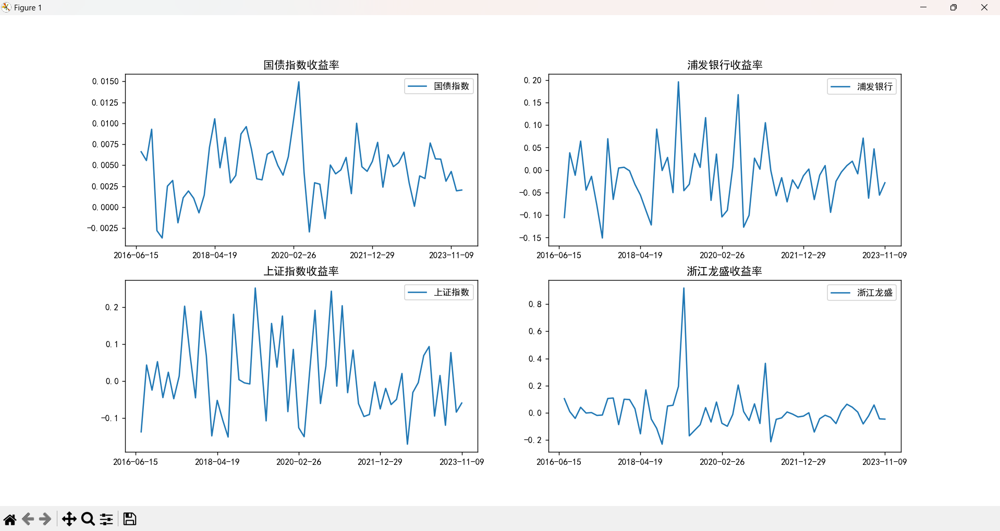
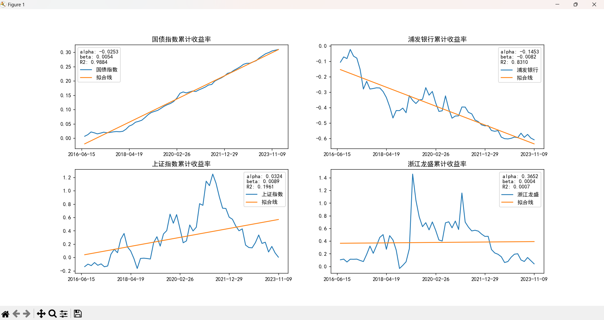

# CAPM验证
分为这几个部分：月度收益率和年度收益率可视化，LS回归，计算相关参数，结果如下

```
国债指数的alpha,beta和R2分别为： -0.02532560831276162 0.00539636589699719 0.9884302020615875
浦发银行的alpha,beta和R2分别为： -0.1453283141930839 -0.008174621348219932 0.8310370799218014
上证指数的alpha,beta和R2分别为： 0.032444747494426274 0.008949218546233035 0.19611040067589314
浙江龙盛的alpha,beta和R2分别为： 0.3652056234397577 0.0004494788604069524 0.0006672557489849629
浦发银行的策略收益率、年化收益率、最大回撤、夏普比率分别为： -0.013295940845386633 -0.3946542653137918 0.3468504652815655 -7.936321648815902
浦发银行的月度收益率均值、标准差、方差分别为： -0.013295940845386633 0.0679551820882798 0.004617906772651264
浙江龙盛的策略收益率、年化收益率、最大回撤、夏普比率分别为： 0.01002518433154188 0.37891472868216974 1.1486725842006211 1.5013045463953305   
浙江龙盛的月度收益率均值、标准差、方差分别为： 0.01002518433154188 0.15603417161559358 0.02434666271176451
浦发银行和浙江龙盛的协方差和相关系数分别为： 0.0019865379359480556 0.18735037332656862
```



